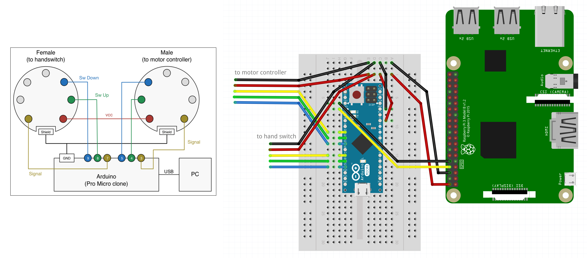

# Standing Desk

Some introduction

## Overview

Foo

## Hardware Components

Foo

### Wiring



## Software Components

1. `xxxx.ino` is a small Arduino xxxx which controls the xxx.
   - Copyright by xxxxxxxx
2. `desk-server.go` is a small Golang program which exposes HTTP methods for controlling the desk and runs on the Raspberry Pi.
   - Adapted from David Knezić https://github.com/davidknezic/desk/blob/master/bridge.go
3. `ssh_desk_handler.py` is a small Python program which enables controlling the desk via SSH from your machine.
   - See [visini/stand](https://github.com/visini/stand) or [visini/timebox](https://github.com/visini/timebox)

### Installation

See `Makefile` for detailed steps. :

```shell
# see david knezic!!!!!!!!!!!!!!!!!!!!!!!!!!!!!!!!!!!!!!!
git clone https://github.com/visini/desk.git
make install-go
make ...
```

## Credits and Further Resources

- david knezic
- desk control.ino guy
- the guy with the drawing
